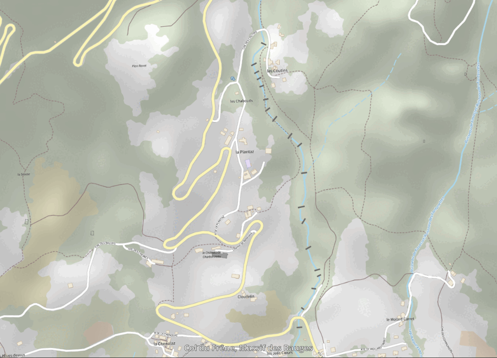

# README - Cartographie à grande échelle à partir du LIDAR HD

## Introduction
Ce readme détaille le processus de création d'une carte détaillée en utilisant des données LIDAR HD.
Deux versions à grande 

 L'objectif est de recalculer un Modèle Numérique de Surface (MNS) et un Modèle Numérique de Terrain (MNT) à une résolution de 20 cm et d'exploiter ces données pour générer divers rendus cartographiques. Une comparaison avec les produits de l'IGN (MNS à 50 cm) est également réalisée, et les principales problématiques rencontrées sont exposées.

## 1. Version MNS
Le Modèle Numérique de Surface (MNS) comprend la végétation et les bâtiments. Il est utilisé pour des analyses topographiques détaillées et la génération d'ombres portées.

### 1.1 Couches et traitements associés
#### 1.1.1 MNS
- Produit à partir des données LIDAR HD 20 cm.
- Génération à l'aide de PDAL et GDAL avec un filtre pour éliminer les artefacts et interpoler les zones vides si nécessaire.
- Placé en base de pyramide des couches SIG.

#### 1.1.2 MNT Multidirectionnel
- Utilisé pour renforcer la perception des reliefs en combinant plusieurs directions d’ombre portée.
- Créé avec une combinaison de pentes dérivées et d’un filtrage adaptatif.

#### 1.1.3 Ombre Portée
- Générée avec un algorithme optimisé et plus rapide que les solutions existantes.
- Placement au-dessus du MNS dans la pyramide de couches.

#### 1.1.4 Pente
- Produit à l’aide de GDAL-Slope.
- Utilisé pour identifier les zones à forte déclivité.

#### 1.1.5 Carte des Classes et Cosia
- Complète les analyses en apportant une information sur l’occupation du sol.
- Intégration des données Cosia de l’IGN pour améliorer la précision.

### 1.2 Symbologie et place dans la pyramide
- **MNS** : Affichage en teinte ombrée avec transparence.
- **Ombre portée** : Superposée en transparence pour renforcer le relief.
- **Carte des classes et Cosia** : Superposition avec transparence contrôlée.

### 1.3 Traitement automatique des objets sur les cours d’eau
- Identification automatique des objets situés sur les cours d’eau via un filtrage spécifique.
- Découpage du MNS en fonction des données hydrologiques.

## 2. Version MNT et Courbes de Niveau
Le Modèle Numérique de Terrain (MNT) exclut les éléments non topographiques pour une représentation pure du relief.

### 2.1 Couches et traitements associés
#### 2.1.1 MNT
- Calculé en excluant la végétation et les bâtiments.
- Produit à partir des données LIDAR filtrées.

#### 2.1.2 MNT Multidirectionnel
- Créé pour améliorer la lisibilité des reliefs avec plusieurs directions de lumière.

#### 2.1.3 Courbes de Niveau
- Générées depuis le MNT avec GDAL-Contour.
- Utilisées pour des visualisations détaillées du terrain.

#### 2.1.4 Carte des Classes et Cosia
- Permet d’affiner l’interprétation des données topographiques.
- Superposée avec un filtrage sélectif.

### 2.2 Symbologie et place dans la pyramide
- **MNT** : Affiché en nuances de gris.
- **Courbes de niveau** : Superposées avec un espacement adapté à l’échelle d’affichage.
- **Carte des classes et Cosia** : Intégrée pour contextualiser l’occupation du sol.

## 3. Coût de Traitement
Le traitement des données est chiffré comme suit :
- **Prétraitement des données LIDAR (PDAL)** : 2h par dalle de 5x5 km sur une machine standard.
- **Génération du MNS / MNT (GDAL, Python)** : 3h pour une dalle complète.
- **Calcul des pentes et des ombres portées** :
  - **Avec un algorithme standard** : 4h par dalle.
  - **Avec l’algorithme optimisé** : 1h30 par dalle, soit un gain de temps significatif.

## 4. Problématiques et Améliorations
- **Amélioration du calcul des ombres portées** : Exploration d’algorithmes plus performants et d’une meilleure gestion des zones ombragées.
- **Traitement des interpolations** : Découpage préalable des MNS sur les zones d’eau en intégrant les cartes de classe pour éviter l’élimination de la végétation sur les rivières.
- **Automatisation accrue** : Mise en place d’un script complet pour le pipeline de traitement et l’intégration dans QGIS.
- **Tests sur de grandes zones** : Étendre la méthode à des régions comme La Réunion, en tuilant les données et en optimisant les performances.

## 5. Conclusion
La cartographie LIDAR HD permet une restitution très détaillée du terrain, avec un gain notable en précision par rapport aux MNS IGN 50 cm. Cependant, des améliorations restent possibles, notamment dans la gestion des interpolations et l’optimisation des traitements d’ombre et de pente.

L’intégration de ces méthodologies dans un flux de travail SIG automatisé permettrait une production plus efficace de cartes adaptées aux grandes échelles (1:1000 et plus).

Des tests complémentaires et une validation sur de nouvelles zones permettront d’affiner ces approches et d’explorer de nouvelles pistes d’amélioration.

## 6. Illustrations
_(Ajouter ici des images comparant MNS 20 cm vs MNS 50 cm, des exemples de pentes et d’ombres portées avec différents algorithmes, ainsi que des cartes générées avec les données Cosia.)_

# Estompage

Descriptif des Traitements effectués:

gdal2tiles.py --zoom 1-10 C:\Users\VHeau\Downloads\rendu.tif

$ python C:/Users/VHeau/AppData/Local/miniconda3/Scripts/mb-util "D:/Estompage/LIDARHD-Test/LA REUNION/MNS-Saintpaul.mbtiles" "D:/Estompage/LIDARHD-Test/LA REUNION/sortie2" --image_format=png

https://rxlacroix.github.io/articles/cartetopoign.html